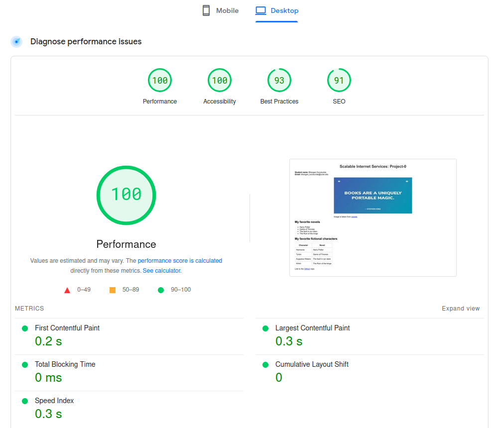

# project0 - Fall 2024 - Scalable Internet Services
Name: Kurukunda Bhargavi

Email: bhargavi_kurukunda@ucsb.edu
## ab analysis and observations

**Testing for other powers of two concurrency levels (-t 10):**

| Concurrency Level | Run-1 | Run-2 | Run-3 | Average Requests (3 Runs each) |
| ----- | ------ | ----- | ----- | ----- |
| c1 | 339 | 316 | 336 | 330.34 |
| c2 | 645 | 643 | 649 | 645.7 |
| c4 | 982 | 806 | 1194 | 994 |
| c8 | 2438 | 1847 | 1987 | 2090.7 |
| c16 | 3778 | 3420 | 3882 | 3693.3 |
| c32 | 5058 | 5099 | 5330 | 5162.3 |
| c64 | 7102 | 7028 | 6923 | 7017.7 |
| c128 | 8242 | 8279 | 8198 | 8239.7 |
| c256 | 8601 | 8811 | 8772 | 8728 |

**Why are there diminishing returns at higher concurrency levels?**

- At higher concurrency levels we notice that there is not much change in the completed requests even after an significant increase in concurrenct levels (64, 128, 256). Sometimes you might even notice some non-2xx requests.
- This might occur due to bottlenecks in CPU, memory or connection overhead in server.
- While having more concurrency levels can give a better performance, increasing it beyond a point will make it inefficient.

--------------

**What’s the performance difference when requesting HTTP and HTTPS?**

> ab testing for https://bhargavi-hash.github.io/project0/ (-t 10 -c 16)

```
Server Software:        GitHub.com
Server Hostname:        bhargavi-hash.github.io
Server Port:            443
SSL/TLS Protocol:       TLSv1.2,ECDHE-RSA-CHACHA20-POLY1305,2048,256
Server Temp Key:        X25519 253 bits
TLS Server Name:        bhargavi-hash.github.io

Document Path:          /project0/
Document Length:        1383 bytes

Concurrency Level:      16
Time taken for tests:   10.003 seconds
Complete requests:      3882
Failed requests:        0
Total transferred:      8225876 bytes
HTML transferred:       5368806 bytes
Requests per second:    388.09 [#/sec] (mean)
Time per request:       41.228 [ms] (mean)
Time per request:       2.577 [ms] (mean, across all concurrent requests)
Transfer rate:          803.08 [Kbytes/sec] received

Connection Times (ms)
              min  mean[+/-sd] median   max
Connect:       19   33  36.4     26     281
Processing:     5    8   2.8      7      43
Waiting:        5    7   2.5      7      42
Total:         25   41  36.5     34     291

```

> ab testing for http://bhargavi-hash.github.io/project0/ (-t 10 -c 16)

```
Server Software:        GitHub.com
Server Hostname:        bhargavi-hash.github.io
Server Port:            80

Document Path:          /project0/
Document Length:        162 bytes

Concurrency Level:      16
Time taken for tests:   10.000 seconds
Complete requests:      9581
Failed requests:        5525
   (Connect: 0, Receive: 0, Length: 5525, Exceptions: 0)
Non-2xx responses:      9586
Total transferred:      12884728 bytes
HTML transferred:       9034951 bytes
Requests per second:    958.09 [#/sec] (mean)
Time per request:       16.700 [ms] (mean)
Time per request:       1.044 [ms] (mean, across all concurrent requests)
Transfer rate:          1258.26 [Kbytes/sec] received

Connection Times (ms)
              min  mean[+/-sd] median   max
Connect:        2    6   1.0      6      34
Processing:     6   10  14.9      8     284
Waiting:        6    8   2.1      8      98
Total:         11   16  14.9     15     295

```
**Note:** Notice the SSL/TLS protocol info present in https but not in http

- Completed requests in case of "http"(9581) are almost 2.5 times less than that of "https"(3882)
- The avg connection time in case of "http"(6ms) is almost 5 times less than that of "https"(33ms)

HTTPS is more secures than HTTP because of SSL/TLS encryption protocols. But this security comes with a cost of performance

---------------------

**How can GitHub respond so quickly?**

- Load Balancing Across multiple servers in various locations to distrubute traffic.
- Use of caching mechanism to improve server response time.
- GitHub uses a global CDN to cache and serve static assets (e.g., images, CSS, JavaScript) from edge servers that are closer to users.
---------------

**What is your site’s “Total Blocking Time” (TBT) according to PageSpeed Insights?**



- First Contentful Paint(FCP): First Contentful Paint marks the time at which the first text or image is painted.
- TBT: Sum of all time periods between FCP and Time to Interactive, when task length exceeded 50ms, expressed in milliseconds. 

The page doesn't need any user I/O imputs nor there is any heavy javascript loading which might take longer than 50ms. Hence the TBT is 0.

-------------------

**Initial Run (Run0):** ```ab https://bhargavi-hash.github.io/project0/```
Default concurrency = 1
```
oem@BHARGAVI:~$ ab https://bhargavi-hash.github.io/project0/
This is ApacheBench, Version 2.3 <$Revision: 1879490 $>
Copyright 1996 Adam Twiss, Zeus Technology Ltd, http://www.zeustech.net/
Licensed to The Apache Software Foundation, http://www.apache.org/

Benchmarking bhargavi-hash.github.io (be patient).....done


Server Software:        GitHub.com
Server Hostname:        bhargavi-hash.github.io
Server Port:            443
SSL/TLS Protocol:       TLSv1.2,ECDHE-RSA-CHACHA20-POLY1305,2048,256
Server Temp Key:        X25519 253 bits
TLS Server Name:        bhargavi-hash.github.io

Document Path:          /project0/
Document Length:        1383 bytes

Concurrency Level:      1
Time taken for tests:   0.485 seconds
Complete requests:      1
Failed requests:        0
Total transferred:      2118 bytes
HTML transferred:       1383 bytes
Requests per second:    2.06 [#/sec] (mean)
Time per request:       484.522 [ms] (mean)
Time per request:       484.522 [ms] (mean, across all concurrent requests)
Transfer rate:          4.27 [Kbytes/sec] received

Connection Times (ms)
              min  mean[+/-sd] median   max
Connect:      259  259   0.0    259     259
Processing:   225  225   0.0    225     225
Waiting:      225  225   0.0    225     225
Total:        484  484   0.0    484     484
```
--------
**Run1:** Adding ```-t 10``` and  ```-c 2``` flags to set timelimit to 10 and concurrency to 2
```
oem@BHARGAVI:~$ ab -t 10 -c 2 https://bhargavi-hash.github.io/project0/
This is ApacheBench, Version 2.3 <$Revision: 1879490 $>
Copyright 1996 Adam Twiss, Zeus Technology Ltd, http://www.zeustech.net/
Licensed to The Apache Software Foundation, http://www.apache.org/

Benchmarking bhargavi-hash.github.io (be patient)
Finished 645 requests


Server Software:        GitHub.com
Server Hostname:        bhargavi-hash.github.io
Server Port:            443
SSL/TLS Protocol:       TLSv1.2,ECDHE-RSA-CHACHA20-POLY1305,2048,256
Server Temp Key:        X25519 253 bits
TLS Server Name:        bhargavi-hash.github.io

Document Path:          /project0/
Document Length:        1383 bytes

Concurrency Level:      2
Time taken for tests:   10.004 seconds
Complete requests:      645
Failed requests:        0
Total transferred:      1365477 bytes
HTML transferred:       892035 bytes
Requests per second:    64.47 [#/sec] (mean)
Time per request:       31.021 [ms] (mean)
Time per request:       15.510 [ms] (mean, across all concurrent requests)
Transfer rate:          133.29 [Kbytes/sec] received

Connection Times (ms)
              min  mean[+/-sd] median   max
Connect:       18   24   4.5     23     104
Processing:     5    7   3.8      6      87
Waiting:        5    7   3.7      6      87
Total:         24   31   6.0     30     111

Percentage of the requests served within a certain time (ms)
  50%     30
  66%     31
  75%     31
  80%     32
  90%     33
  95%     35
  98%     39
  99%     57
 100%    111 (longest request)
```
-----------
**Run2**
```
oem@BHARGAVI:~$ ab -t 10 -c 2 https://bhargavi-hash.github.io/project0/
This is ApacheBench, Version 2.3 <$Revision: 1879490 $>
Copyright 1996 Adam Twiss, Zeus Technology Ltd, http://www.zeustech.net/
Licensed to The Apache Software Foundation, http://www.apache.org/

Benchmarking bhargavi-hash.github.io (be patient)
Finished 643 requests


Server Software:        GitHub.com
Server Hostname:        bhargavi-hash.github.io
Server Port:            443
SSL/TLS Protocol:       TLSv1.2,ECDHE-RSA-CHACHA20-POLY1305,2048,256
Server Temp Key:        X25519 253 bits
TLS Server Name:        bhargavi-hash.github.io

Document Path:          /project0/
Document Length:        1383 bytes

Concurrency Level:      2
Time taken for tests:   10.009 seconds
Complete requests:      643
Failed requests:        0
Total transferred:      1359987 bytes
HTML transferred:       889269 bytes
Requests per second:    64.24 [#/sec] (mean)
Time per request:       31.134 [ms] (mean)
Time per request:       15.567 [ms] (mean, across all concurrent requests)
Transfer rate:          132.69 [Kbytes/sec] received

Connection Times (ms)
              min  mean[+/-sd] median   max
Connect:       18   24   1.9     24      33
Processing:     5    7   5.0      6     129
Waiting:        5    7   4.9      6     128
Total:         23   31   5.2     30     151

Percentage of the requests served within a certain time (ms)
  50%     30
  66%     31
  75%     31
  80%     32
  90%     33
  95%     34
  98%     37
  99%     38
 100%    151 (longest request)

```
------------
**Run3:**

```
oem@BHARGAVI:~$ ab -t 10 -c 2 https://bhargavi-hash.github.io/project0/
This is ApacheBench, Version 2.3 <$Revision: 1879490 $>
Copyright 1996 Adam Twiss, Zeus Technology Ltd, http://www.zeustech.net/
Licensed to The Apache Software Foundation, http://www.apache.org/

Benchmarking bhargavi-hash.github.io (be patient)
Finished 649 requests


Server Software:        GitHub.com
Server Hostname:        bhargavi-hash.github.io
Server Port:            443
SSL/TLS Protocol:       TLSv1.2,ECDHE-RSA-CHACHA20-POLY1305,2048,256
Server Temp Key:        X25519 253 bits
TLS Server Name:        bhargavi-hash.github.io

Document Path:          /project0/
Document Length:        1383 bytes

Concurrency Level:      2
Time taken for tests:   10.013 seconds
Complete requests:      649
Failed requests:        0
Total transferred:      1374067 bytes
HTML transferred:       897567 bytes
Requests per second:    64.81 [#/sec] (mean)
Time per request:       30.858 [ms] (mean)
Time per request:       15.429 [ms] (mean, across all concurrent requests)
Transfer rate:          134.01 [Kbytes/sec] received

Connection Times (ms)
              min  mean[+/-sd] median   max
Connect:       17   24   4.9     24     107
Processing:     5    6   1.0      6      16
Waiting:        5    6   1.0      6      16
Total:         23   30   5.1     30     113

Percentage of the requests served within a certain time (ms)
  50%     30
  66%     31
  75%     31
  80%     32
  90%     33
  95%     34
  98%     38
  99%     43
 100%    113 (longest request)

```
-------------------
**Run4:** ```ab -t 10 https://bhargavi-hash.github.io/project0/```
```
oem@BHARGAVI:~$ ab -t 10 https://bhargavi-hash.github.io/project0/
This is ApacheBench, Version 2.3 <$Revision: 1879490 $>
Copyright 1996 Adam Twiss, Zeus Technology Ltd, http://www.zeustech.net/
Licensed to The Apache Software Foundation, http://www.apache.org/

Benchmarking bhargavi-hash.github.io (be patient)
Finished 339 requests


Server Software:        GitHub.com
Server Hostname:        bhargavi-hash.github.io
Server Port:            443
SSL/TLS Protocol:       TLSv1.2,ECDHE-RSA-CHACHA20-POLY1305,2048,256
Server Temp Key:        X25519 253 bits
TLS Server Name:        bhargavi-hash.github.io

Document Path:          /project0/
Document Length:        1383 bytes

Concurrency Level:      1
Time taken for tests:   10.002 seconds
Complete requests:      339
Failed requests:        0
Total transferred:      717884 bytes
HTML transferred:       468837 bytes
Requests per second:    33.89 [#/sec] (mean)
Time per request:       29.504 [ms] (mean)
Time per request:       29.504 [ms] (mean, across all concurrent requests)
Transfer rate:          70.09 [Kbytes/sec] received

Connection Times (ms)
              min  mean[+/-sd] median   max
Connect:       17   23   4.9     23      98
Processing:     5    6   0.9      6      15
Waiting:        5    6   0.9      6      15
Total:         22   29   5.1     29     104

Percentage of the requests served within a certain time (ms)
  50%     29
  66%     29
  75%     30
  80%     30
  90%     31
  95%     33
  98%     38
  99%     42
 100%    104 (longest request)

```

-----------
**Testing for other powers of two concurrency levels (-t 10):**

Concurrency Level | Average Requests (3 Runs each)

